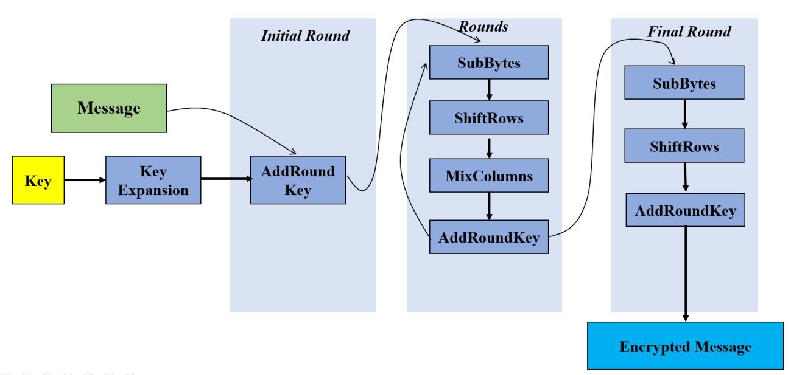

# AES

[](https://github.com/SIIR3X/network-segmenter/blob/main/LICENSE)




## Description

This project is a **C implementation of AES (Advanced Encryption Standard)** using Intel **AES-NI (Advanced Encryption Standard New Instructions)** for hardware-accelerated performance.

It supports **128-bit, 192-bit, and 256-bit key sizes**, and provides multiple **encryption and decryption modes**.

The project is organized into three distinct parts:

- **Main:** A command-line interface inspired by OpenSSL, used to encrypt or decrypt strings from a file.
- **Tests:** A test suite implemented with the Unity framework.
- **Experiments:** A program designed to evaluate the performance of each AES mode, including encryption and decryption speed benchmarks.

The project is compatible with both **Linux** and **Windows** operating systems.


## Features

- **AES Key Sizes**
    - Supports **AES-128**, **AES-192**, and **AES-256**
    - Implemented in: `aes_key_expansion.h`, `aes_encrypt.h`, `aes_decrypt.h`

- **Encryption Modes**
    - Supported modes: **ECB**, **CBC**, **CFB**, **OFB**, **CTR**
    - Implemented in: `aes_ecb.h`, `aes_cbc.h`, `aes_cfb.h`, `aes_ofb.h`, `aes_ctr.h`

- **Padding Schemes** (for ECB and CBC modes)
    - **PKCS#7**, **Zero Padding**, **ANSI X.923**
    - Implemented in: `aes_padding.h`


## Project Structure

The `include/` directory is organized into two main parts:

- **`aes/`** - Contains the core AES logic. It is divided into three subdirectories:
    - `core/` - Low-level AES implementation: key expansion, encryption, decryption, constants, and context structures.
    - `modes/` - Implementations of the different AES operation modes: ECB, CBC, CFB, OFB, and CTR.
    - `padding/` - Padding schemes used in block modes (e.g. PKCS#7, Zero Padding, ANSI X.923).

- **`utils/`** - Contains utility functions used by the **main program only**, such as argument parsing, file handling, and hex string conversion.

```bash
include
├── aes
│   ├── core
│   │   ├── aes_constants.h     # AES constants
│   │   ├── aes_context.h       # AES context structure
│   │   ├── aes_decrypt.h       # AES decryption functions
│   │   ├── aes_encrypt.h       # AES encryption functions
│   │   └── aes_key_expansion.h # AES key expansion functions
│   ├── modes
│   │   ├── aes_cbc.h     # AES CBC mode functions
│   │   ├── aes_cfb.h     # AES CFB mode functions
│   │   ├── aes_ctr.h     # AES CTR mode functions
│   │   ├── aes_ecb.h     # AES ECB mode functions
│   │   └── aes_ofb.h     # AES OFB mode functions
│   └── padding
│       └── aes_padding.h # AES padding functions
└── utils
    ├── main_utils.h
    └── utils.h
```


## Installation

### Dependencies

The following tools are required to **build and run** the project:

- **`gcc`** - or any C compiler with support for AES-NI instructions.
- **`make`** - build system.

### Development Dependencies

These tools are only required for **development**, including testing, memory checking, and documentation:

- **Unity** – unit testing framework *(already included in the project, no installation needed)*
- **`valgrind`** – for memory checks
- **`doxygen`** – to generate documentation from source comments

### Build

To build the main program:

```bash
make
```


## Usage

The main program is executed from the command line with several options to configure the encryption or decryption process.

### Syntax

```bash
./aes -mode <ECB|CBC|CFB|OFB|CTR> -e|-d -in <path> -out <path> -key <hex> [-iv <hex>] [-padding <none|pkcs7|zero|x923>]
```

### Parameters

- `-mode`: AES mode to use. Must be one of: `ECB`, `CBC`, `CFB`, `OFB`, `CTR`.
- `-e`/`-d`: choose encryption (`-e`) or decryption (`-d`).
- `-in <path>`: path to the input file containing plaintext (for encryption) or ciphertext (for decryption).
- `-out <path>`: path to the output file where the result will be written.
- `-key <hex>`: encryption/decryption key in hexadecimal format. Length must correspond to AES-128 (16 bytes), AES-192 (24 bytes), or AES-256 (32 bytes).
- `-iv <hex>` (optional): initialization vector in hexadecimal format. Required for modes other than ECB.
- `-padding <pkcs7|zero|x923>` (optional): padding scheme to apply. Only used in `ECB` and `CBC` modes. Default is `pkcs7`.

### Example

```bash
./aes_main -mode CBC -e -in input.txt -out output.enc -key 000102030405060708090a0b0c0d0e0f -iv 0102030405060708 -padding pkcs7
```


## Makefile Commands

The project includes a `Makefile` with multiple targets to build, run, test, and clean the project.

### Build and Run

- `make all`: Build the main program.
- `make run`: Run the main program with arguments defined in the `Makefile`.
- `make memorycheck`: Run the main program with memory checks (via Valgrind).

### Tests

- `make test`: Build and run the test suite.
- `make memorychecktest`: Run the tests with memory checks (via Valgrind).

### Experiments

- `make expe`: Build and run the experimental programs.
- `make memorycheckexpe`: Run the experiments with memory checks (via Valgrind).

### Cleaning and Deletion

- `make clean`: Remove object and binary files.
- `make delete`: Delete the main program executable.
- `make deletetest`: Delete the test program executable.
- `make deleteexpe`: Delete the experiment program executable.
- `make cleanall`: Remove all object and binary files, including directories.

### Documentation

- `make doc`: Generate documentation using Doxygen.


## Experiments

Performance benchmarks were conducted to evaluate the speed of each AES mode for both encryption and decryption.

### Test Setup

- **Processor:** AMD Ryzen 7 9800X3D  
- **Data:** 1000 MB of randomly generated data  
- **Key & IV:** Randomly generated 128-bit key and initialization vector for each test  
- **Repetitions:** 10 runs per AES mode using the same data, key, and IV set

### Methodology

For each AES mode and operation (encryption and decryption), the total execution time across 10 runs was summed, then divided by the number of runs to compute the average time. The average throughput (in MB/s) was then calculated using the 1000 MB dataset and the corresponding average time.

The benchmarks were run directly on the `encrypt` and `decrypt` functions of each mode implementation (`ECB`, `CBC`, etc.). These tests exclude any surrounding logic such as data parsing, key/IV conversion, padding/unpadding, or file I/O — all of which are present in the main CLI program. This isolates the raw performance of the mode-level encryption and decryption routines.

### Results

| Mode | Avg Encrypt Time (ms) | Avg Encrypt Speed (MB/s) | Avg Decrypt Time (ms) | Avg Decrypt Speed (MB/s) |
|------|------------------------|---------------------------|------------------------|---------------------------|
| ECB  | 218.59                 | 4574.73                   | 130.65                 | 7653.96                   |
| CBC  | 814.19                 | 1228.22                   | 126.35                 | 7914.75                   |
| CFB  | 826.70                 | 1209.63                   | 156.02                 | 6409.57                   |
| OFB  | 790.73                 | 1264.65                   | 749.89                 | 1333.53                   |
| CTR  | 1068.84                | 935.59                    | 1011.60                | 988.54                    |


## License

This project is licensed under the **MIT License**. See the [LICENSE](LICENSE) file for details.
